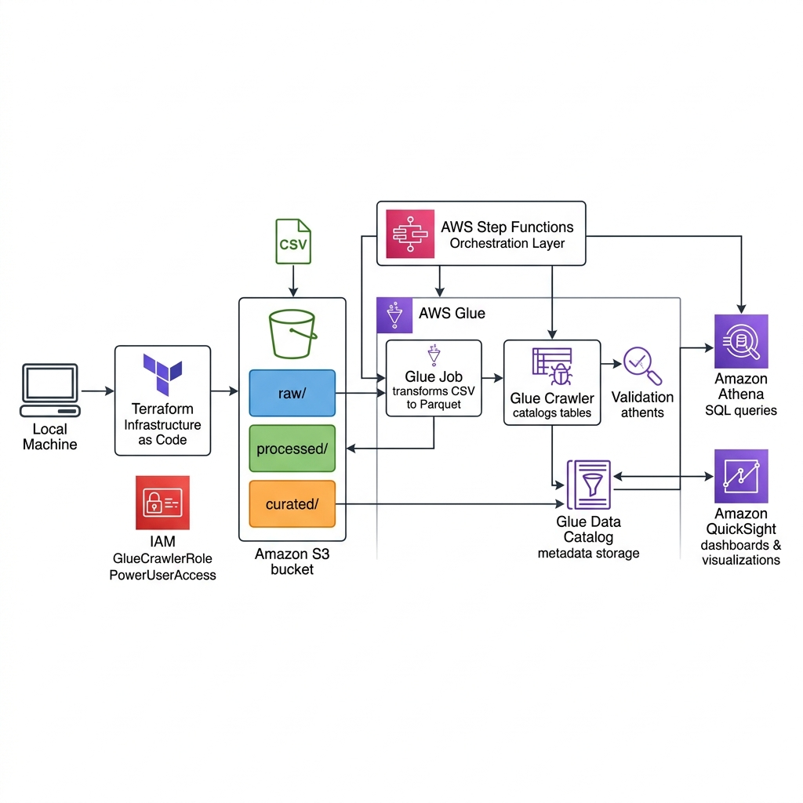

# AWS Data Engineering Capstone - Team XX

## Visión General
Este repositorio contiene el código y la documentación de nuestro Proyecto Final (Ruta A) para el curso de AWS Academy Data Engineering. 
El objetivo del proyecto es procesar datos globales de pesca marítima (Sea Around Us) diseñando, implementando y operando una tubería de datos (Data Pipeline) de extremo a extremo en AWS utilizando S3, AWS Glue, Athena y Amazon QuickSight.

## 🏗️ Arquitectura


## 👥 Miembros del Equipo y Roles

| Nombre | Rol | Responsabilidad Principal |
| :--- | :--- | :--- |
| **[Nombre 1]** | **Rol 1: Data Engineer** | Ingesta de datos, transformación CSV→Parquet, Glue Crawler |
| **[Nombre 2]** | **Rol 2: Data Quality Engineer** | 10 reglas de validación, reporte de calidad HTML |
| **[Nombre 3]** | **Rol 3: Analytics Engineer** | 5 vistas SQL en Athena, benchmark, dashboard QuickSight |
| **[Nombre 4]** | **Rol 4: Orchestration & Ops** | Step Functions, seguridad IAM, diagrama de arquitectura |

## 📊 Dataset
- **Fuente:** [Sea Around Us](https://www.seaaroundus.org/) - Datos de pesca marítima global (1950–2018)
- **Archivos utilizados:**
  - `global.csv` — Captura pesquera global (~568K filas)
  - `eez.csv` — Zonas Económicas Exclusivas (~481K filas)
  - `high_seas.csv` — Alta Mar (~25K filas)
  - `fishing_entity.csv` — Entidades pesqueras por país (~791K filas) *(4to archivo adicional)*
- **Total:** ~1.87 millones de registros

## 📁 Estructura del Repositorio

```
data-eng-project-teamXX/
├── README.md                           # Este archivo
├── .gitignore                          # Protege credenciales y datos pesados
├── docs/
│   ├── architecture.png                # Diagrama de arquitectura AWS
│   └── technical_decisions.md          # ADRs: por qué Parquet, partición por year, etc.
├── pipeline/                           # Rol 1: Data Engineer
│   ├── scripts/
│   │   └── glue_job.py                 # PySpark: CSV → Parquet particionado por year
│   └── terraform/
│       ├── main.tf                     # Infraestructura como código (S3, Glue, Crawler)
│       └── variables.tf                # Variables de configuración
├── data_quality/                       # Rol 2: Data Quality Engineer
│   ├── validate_quality.py             # Script de validación con 10 reglas
│   ├── rules.md                        # Documentación de las 10 reglas con justificación
│   └── report.html                     # Reporte ejecutado con resultados reales
├── analytics/                          # Rol 3: Analytics Engineer
│   ├── view_01_top10_countries.sql     # Top 10 países pesqueros
│   ├── view_02_catch_trend.sql         # Tendencia de captura por año
│   ├── view_03_sector_reporting.sql    # Industrial vs Artesanal
│   ├── view_04_top_species.sql         # Top 15 especies en alta mar
│   ├── view_05_eez_by_decade.sql       # Captura por zona EEZ y década
│   ├── benchmark_queries.sql           # 3 queries para comparar CSV vs Parquet
│   ├── benchmark.md                    # Tabla comparativa de rendimiento
│   └── dashboard.md                    # Descripción de las 4 visualizaciones
├── orchestration/                      # Rol 4: Orchestration & Ops
│   ├── step_functions_definition.json  # AWS Step Functions (orquestación)
│   ├── run_pipeline.sh                 # Script bash alternativo
│   ├── architecture.png                # Diagrama de arquitectura
│   └── security.md                     # Políticas de seguridad y acceso
├── data_samples/                       # Muestras pequeñas de los CSV (50 filas c/u)
│   ├── global.csv
│   ├── eez.csv
│   ├── high_seas.csv
│   └── fishing_entity.csv
└── presentation/
    └── slides.pdf                      # (Por agregar antes de la presentación)
```

## 🚀 Cómo Ejecutar el Proyecto

### Prerrequisitos
- Cuenta de AWS con permisos de `PowerUserAccess`
- [Terraform](https://www.terraform.io/downloads) instalado
- [AWS CLI](https://aws.amazon.com/cli/) configurado con credenciales válidas
- Python 3.8+ con `pandas` instalado

### Paso 1: Crear la infraestructura (Rol 1)
```bash
cd pipeline/terraform
terraform init
terraform apply    # Escribe "yes" cuando lo pida
```
Esto crea el bucket S3, sube los 4 CSV, configura el Glue Job y el Crawler.

### Paso 2: Ejecutar el pipeline completo (Rol 4)
**Opción A — AWS Step Functions (recomendado):**
1. Ir a la consola de AWS Step Functions.
2. Crear una nueva State Machine con el contenido de `orchestration/step_functions_definition.json`.
3. Ejecutar la State Machine.

**Opción B — Script bash:**
```bash
chmod +x orchestration/run_pipeline.sh
./orchestration/run_pipeline.sh
```

### Paso 3: Validar calidad de datos (Rol 2)
```bash
pip install pandas
python data_quality/validate_quality.py
```
Genera `data_quality/report.html` con los resultados.

### Paso 4: Ejecutar queries en Athena (Rol 3)
1. Ir a Amazon Athena en la consola de AWS.
2. Seleccionar la base de datos `fisheries_db_diego`.
3. Copiar y ejecutar las queries de `analytics/benchmark_queries.sql`.
4. Crear las vistas con los archivos `view_*.sql`.

### Paso 5: Crear dashboard en QuickSight (Rol 3)
Seguir las instrucciones en `analytics/dashboard.md`.

## 🔐 Seguridad
- No se exponen credenciales en el repositorio (protegido por `.gitignore`).
- Se utiliza el rol `GlueCrawlerRole` para servicios de AWS Glue.
- Los usuarios del equipo tienen `PowerUserAccess` (sin permisos de IAM).
- Ver detalles completos en `orchestration/security.md`.

## 📄 Decisiones Técnicas
Ver `docs/technical_decisions.md` para la justificación de:
- Uso de formato Parquet
- Particionamiento por columna `year`
- Elección de herramientas de orquestación
